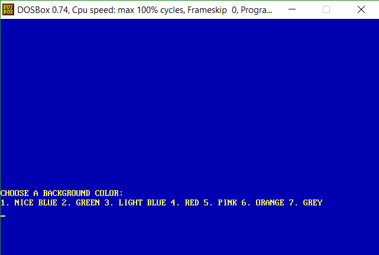
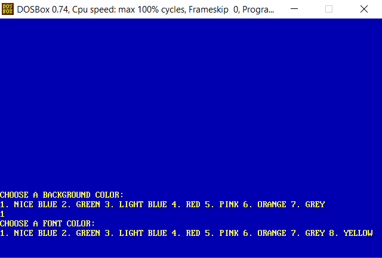
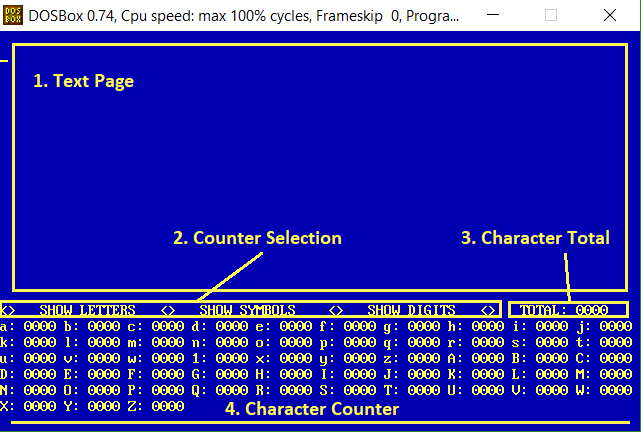

# Easy Character Counter
A lightweight text editor written in Assembly with built-in character counter and different theme options.

## Introduction  
Easy Character Counter is a product designed to help anyone find the number of characters in
a small text paragraph. The portability and the user-friendly interface recommend it for quick
notes check.  

## Set-up  
In order to run the application, install DOSBox.  

## Fresh Start  
Move the easy_character_counter.asm file in the TASM installation directory, open DOSBox, execute TASM
easy_character_counter command to assemble the file (an .obj file is created), execute TLINK easy_character_counter
command to link object modules (an .exe file is created), execute ECCount to run the program.

## Theme selection   

## Main text editing window  

